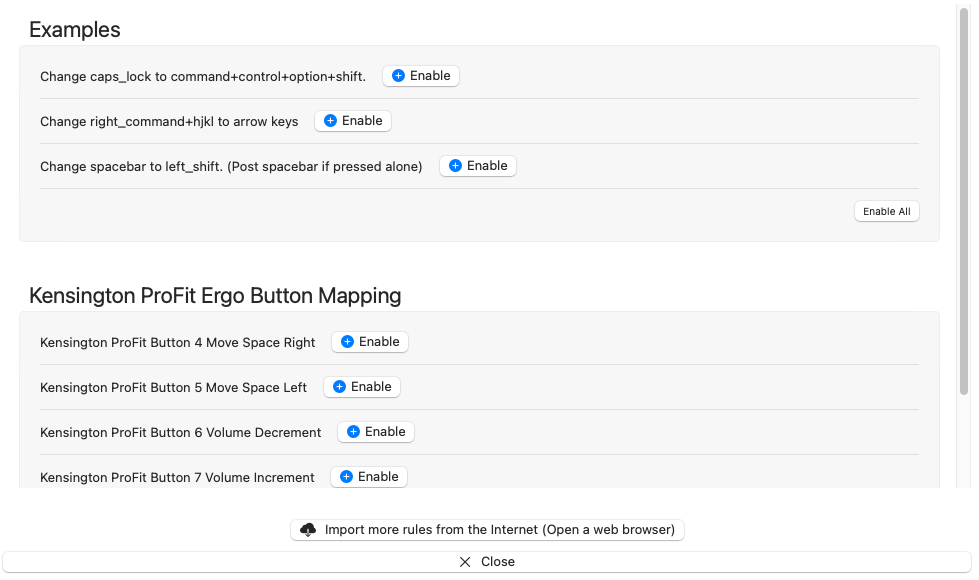

# Overview

## Kensington ProFit Vertical Track Ball

Using karabiner I wanted to setup custom options for buttons 4,5,6,7 on the
mouse. While karabiner-elements lists (32) total buttons I was only able to
determine the responses for buttons 1,2,3,4,5,6,7 through karabiner-eventviewer.

Paired with the Keychron K3 V2 the following features are in my first
iteration.

1. Switch spaces left(5) and right(4)
2. Volume up(7) down(6) 

## Installation

Depending on what you prefer you can perform one of the following installation
processes.

### Clone repository and create symlink

1. Clone this repository into a location that you keep all of your git projects.
1. Navigate to ~/.config/karabiner/assets/complex_modifications
1. Create symbolic link to remap_buttons.json
   ```
   ln -s /place/where/you/cloned/repo/kensington_profit_ergo/remap_buttons.json .
   ```

### Copy raw file from github and place in .config directory

1. Copy the raw output of 
   ```
   https://github.com/stevescally/kensington-karabiner-elements/blob/main/kensington_profit_ergo/remap_buttons.json
   ```
1. Create file remap_buttons.json in ~/.config/karabiner/assets/complex_modifications
1. Paste copied content into new file and save

## Activation / Enable

1. Open Karabiner-Elements Preferences
1. Select __Complex Modifications__

   

1. Click __Add rule__

   

1. Click __Enable__ option next to the specific rules you want to enable or select __Enable All__
   in the bottom right corner.


